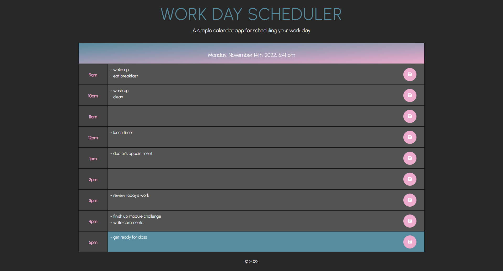

# Module 5 Challenge

## Work Day Scheduler

### Description

In this challenge, I have created a functional 9-5 work day scheduler to lay out all your day's activities.
Input anything within the text area to keep yourself updated & productive. When pressing save, you can keep 
your daily tasks within the scheduler, even if you leave the page & come back. It also is flexible to use on
mobile or tablet to not clog up your screen space. All tasks are stored locally so you don't have to worry 
about anyone but you seeing what you're up to. Try it yourself!

### Screenshot

Here is a preview of how the scheduler looks.

Here is an example of how it looks like with a few events saved. 

### GitHub Repository 

You can view my coding process (however clumsy haha) at the link below.

https://github.com/kirbyfridge/work-day-scheduler

### GitHub Pages

You can view the functional webpage at the link below.

https://kirbyfridge.github.io/work-day-scheduler
